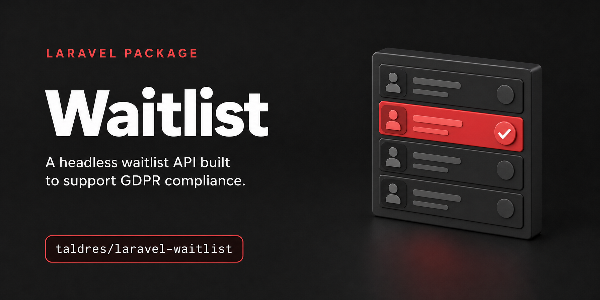

# Laravel Waitlist

> **Headless waitlists for Laravel, built to support GDPR compliance: encrypted addresses, consent records per purpose, configurable retention, and self-service APIs.**
>
> Bring your own UI. Bring your own mail provider.


An API-first Laravel package for waitlists and early access: double opt-in,
consent recorded per purpose, token-based confirm, unsubscribe and preference
flows, retention periods, events, CSV export and daily reporting. It ships no
dashboard and no mail delivery, so your application keeps its own frontend, mail
provider and workflow.

## Why this package?

Privacy is the design constraint, not an add-on.

- **Required purpose choice.** The signup API requires a primary purpose choice; optional purposes such as a newsletter are recorded and withdrawn separately
- **Versioned consent records.** Each consent stores the registered text, version and locale; your application must display that text and obtain a valid agreement
- **Encrypted at rest.** Addresses, metadata, IP and user agent are always encrypted with `APP_KEY`, or with your own encrypter; lookups run on a keyed hash, so these fields are unreadable in a database dump without the encryption key
- **Scheduled retention.** The package registers a cleanup schedule for abandoned signups, people who left and request metadata; your application must run and monitor Laravel's scheduler
- **People help themselves.** A preference page lets them change purposes, download their data and erase it, without writing to your support. It opens with a short-lived link that is mailed to the address on request; the link in every mail can only remove
- **Minimal by default.** Double opt-in on, IP and user agent off, no metadata accepted over HTTP unless a project or list defines the fields, with Laravel validation rules
- **No built-in mail delivery or outbound requests.** Your application controls mail, integrations, exports and other data flows; `waitlist:privacy` lists registered package-event listeners to help you review them
- **Correct under load.** State changes are conditional updates, so every event fires exactly once, even when two requests race

**The application operator is responsible for the lawfulness and security of its
processing, including its configuration, consent flow, retention and integrations.**
The package provides technical features, not legal advice, certification or a
warranty of GDPR compliance. It is provided under the [MIT License](LICENSE.md),
including its warranty and liability disclaimer, subject to applicable mandatory
law. See [Operator responsibilities and limitations](docs/responsibility.md) and
[GDPR in practice](docs/gdpr.md).

Honest trade-off: if you want a ready-made invite workflow (`invited`,
`rejected`, auto-sent mails), this is intentionally not that package. Build it on
top via events and macros, see [the invite flow example](docs/examples/invite-flow.md).

## Requirements

- PHP 8.3+
- Laravel 12 or 13
- SQLite 3.26+, MySQL 5.7+, MariaDB 10.3+ or PostgreSQL 10+

## Installation

```bash
composer require taldres/laravel-waitlist

php artisan waitlist:install
php artisan migrate
```

`waitlist:install` publishes the migrations, the config and
`app/Providers/WaitlistServiceProvider.php`, where you describe your waitlist,
and registers that provider.

Addresses are encrypted with `APP_KEY`: back it up apart from the database, and
keep the old key in `APP_PREVIOUS_KEYS` when you rotate it. See
[Encryption and keys](docs/encryption-and-keys.md).

## Quickstart

Define what people agree to, and which list asks for what:

```php
// app/Providers/WaitlistServiceProvider.php
use Taldres\Waitlist\Definitions\ProjectDefinition;
use Taldres\Waitlist\Facades\Waitlist;

public function boot(): void
{
    Waitlist::define(function (ProjectDefinition $project): void {
        $project->purpose('waitlist', ['2026-10' => 'Email me when early access opens.']);
        $project->purpose('newsletter', ['2026-10' => 'Also send me the monthly newsletter.']);

        $project->list('default', purpose: 'waitlist')->optional('newsletter');

        // Pages your mail links point at, which post the token back
        $project->urls(
            confirm: config('app.frontend_url').'/waitlist/confirm/{token}',
            unsubscribe: config('app.frontend_url').'/waitlist/leave/{token}',
        );
    });
}
```

Each list has one primary purpose, which is required, so two purposes can never
be bundled into one checkbox; the newsletter is chosen on its own. Never edit a
version's wording: add a new version. A signup can carry more than the address
when a project or list defines the fields, with any Laravel validation rule:

```php
$project->list('teams', purpose: 'waitlist')->fields(fn () => [
    'company' => ['required', 'string', 'max:120'],
    'plan' => ['nullable', Rule::enum(Plan::class)],
]);
```

Render the wording from the package, then post back the versions that were shown:

```php
use Taldres\Waitlist\Facades\Waitlist;

Waitlist::purposes('default');   // list<PurposeWording>: purpose, version, locale, text, hash(), required

$result = Waitlist::for('default')->add('jane@example.com', [
    'waitlist' => '2026-10',
    'newsletter' => '2026-10',   // only if the box was ticked
]);
```

The package sends no mail. Your listener sends the confirmation:

```php
use Illuminate\Contracts\Queue\ShouldBeEncrypted;
use Illuminate\Contracts\Queue\ShouldQueue;
use Taldres\Waitlist\Events\EntrySubscribed;

class SendWaitlistConfirmationMail implements ShouldQueue, ShouldBeEncrypted
{
    public function handle(EntrySubscribed $event): void
    {
        if (! $event->requiresConfirmation) {
            return;
        }

        // ConfirmWaitlistMail is yours: see docs/mail.md for one
        Mail::to($event->entry->email)->send(new ConfirmWaitlistMail(
            $event->confirmUrl,
            $event->unsubscribeUrl,
            $event->subscription->consents->pluck('text')->all(),
        ));

        Waitlist::confirmationMailed($event->subscription, 'confirm-mail@2026-10');
    }
}
```

Your pages post the token back:

```php
Waitlist::confirm($confirmToken);                            // fires EntryConfirmed
Waitlist::withdrawConsent($unsubscribeToken, 'newsletter');  // only the newsletter
Waitlist::unsubscribe($unsubscribeToken);                    // leaves the list
```

Once confirmed, ask before you send. `recipients()` streams everyone a mail may
go to, once per address, with the links that mail must carry:

```php
Waitlist::recipients('newsletter')->each(fn (Recipient $recipient) => Mail::to($recipient->email)
    ->locale($recipient->locale)
    ->queue(new NewsletterMail($recipient)));   // carries $recipient->unsubscribeUrl() and ->listUnsubscribeHeaders()
```

No Laravel backend for the pages? Enable the JSON API with
`WAITLIST_ROUTES_ENABLED=true`, see the [HTTP API](docs/reference/http-api.md).
[Getting started](docs/getting-started.md) walks through the whole flow both ways.

## Which setup do you have?

| You have | Start with |
| --- | --- |
| One product, pages rendered by Laravel (Blade, Livewire, Inertia) | [Getting started](docs/getting-started.md) |
| One product, a static landing page or SPA | [Example: a landing page or SPA](docs/examples/landing-page-spa.md) |
| Several products in one app | [Projects, lists and fields](docs/projects.md), [example](docs/examples/several-products.md) |
| A central API serving the waitlists of all your products | [Example: a central waitlist API](docs/examples/central-waitlist-api.md) |

One product needs one definition: `Waitlist::define()` without a name describes
the `default` project, and the facade acts on it.

## Documentation

- **Guides:** [Getting started](docs/getting-started.md) ·
  [Projects, lists and fields](docs/projects.md) ·
  [Purposes and wording](docs/purposes-and-wording.md) ·
  [Mail](docs/mail.md) ·
  [Sync to your email provider](docs/email-provider-sync.md) ·
  [Lifecycle](docs/lifecycle.md) ·
  [Reporting](docs/reporting.md) ·
  [Securing the endpoints](docs/securing-the-endpoints.md) ·
  [Encryption and keys](docs/encryption-and-keys.md) ·
  [Extending](docs/extending.md)
- **Privacy:** [GDPR in practice](docs/gdpr.md) ·
  [Operator responsibilities](docs/responsibility.md)
- **Reference:** [Configuration](docs/reference/configuration.md) ·
  [PHP API](docs/reference/php-api.md) ·
  [HTTP API](docs/reference/http-api.md) ·
  [Events](docs/reference/events.md) ·
  [Commands](docs/reference/commands.md)

The [documentation index](docs/README.md) lists every page with a line on what it covers.

## AI agents

The package ships [Laravel Boost](https://github.com/laravel/boost) skills. Run
`php artisan boost:install` and select `taldres/laravel-waitlist` among the
third-party packages; agents such as Claude Code, Codex or Cursor then integrate
the waitlist the way these docs describe. A non-interactive install only picks
up packages listed under `packages` in `boost.json`.

| Skill | For |
| --- | --- |
| `laravel-waitlist-development` | the integration as a whole |
| `laravel-waitlist-frontend` | signup form, confirm, unsubscribe and preference pages |
| `laravel-waitlist-mail` | every mail the flow needs, a sender per project |
| `laravel-waitlist-provider-sync` | Brevo, Mailchimp, Mailcoach in step, both ways |
| `laravel-waitlist-projects` | several products in one app |
| `laravel-waitlist-reporting` | statistics for dashboards and charts |
| `laravel-waitlist-launch` | invitations, the launch mail, erasing the list afterwards |
| `laravel-waitlist-privacy-operations` | access and erasure requests, retention, key rotation |
| `laravel-waitlist-testing` | feature tests for the integration |

## Development

Built on the [Laravel package skeleton](https://github.com/laravel/package-skeleton):

```bash
composer test       # PHPStan level 10, Pint, type coverage, Pest
composer lint       # Pint
composer serve      # workbench app with the HTTP API enabled
```

Concurrency tests act as two clients on two connections against one database.
They are skipped on SQLite, where an in-memory database is per connection:

```bash
DB_CONNECTION=mysql vendor/bin/pest
DB_CONNECTION=mariadb vendor/bin/pest
DB_CONNECTION=pgsql vendor/bin/pest
```

See [CONTRIBUTING](.github/CONTRIBUTING.md) and the [changelog](CHANGELOG.md).

## License

MIT. See [LICENSE.md](LICENSE.md).
